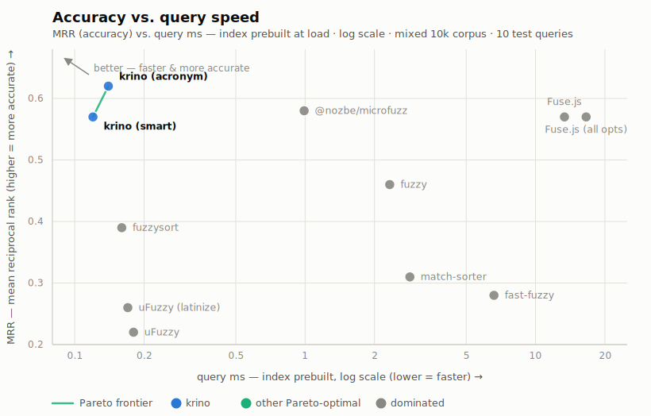
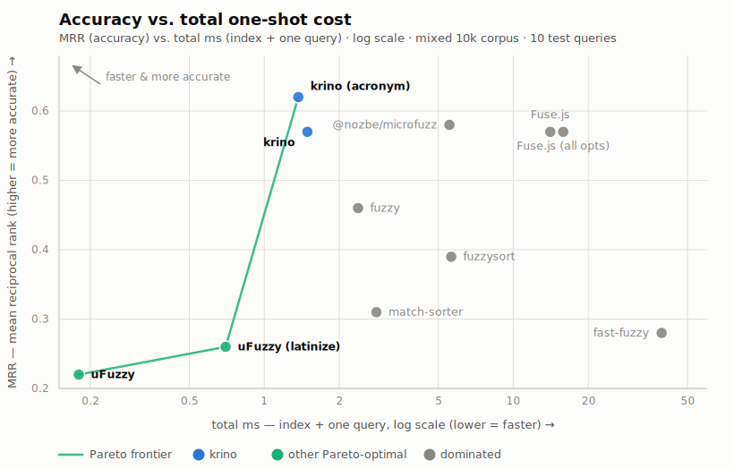

# Benchmarks: match quality and speed

Full data behind the README's summary: what each library calls a match, where it ranks the right answer, and what a query costs.
Everything here regenerates from the repo:

- `pnpm bench && node bench/report.mjs` — the speed tables
- `node bench/scorecard.mjs` — the scorecard (5 fresh processes, medianed)
- `pnpm --filter=krino-bench test` — the match/rank tables ([`bench/hits.test.ts`](../bench/hits.test.ts)) and the pre-filter funnel ([`bench/funnel.test.ts`](../bench/funnel.test.ts))

Scope a dev run to one table with `BENCH=mixed-10k pnpm bench` (tokens: a corpus, a size, or `corpus-size`, comma-separable); scoped runs skip `results.json` so they can't clobber the published matrix, which always comes from a full run.
The corpora are frozen JSON snapshots (`bench/corpus-*.json`), so runs pay no generation cost and the data can't drift when faker changes between versions; regenerating them is a deliberate act ([`bench/corpus-gen.test.ts`](../bench/corpus-gen.test.ts)) that rewrites history for every rank table here.
Improvements to the benchmarks are welcome.

## Before matching: the index

Every query number in this document times a **prebuilt** searcher, so the first question is what building one costs, and where each library hides its preparation.
There are three ledgers: **eager** (Krino and fast-fuzzy build their structures up front; Fuse.js nominally sits here too, but its trivial index defers the real work to query time), **lazy** (microfuzz defers part of its preparation to the first search — its own docs: "the first search takes ~7 ms, subsequent under 1.5 ms" — and fuzzysort quietly does the same, preparing every string target on the first `go()` and caching them process-wide, ~87× the cost of a steady query at 10k; the Scorecard prices both slices into the **index** column — microfuzz as build + first search − one steady search, fuzzysort as an explicit prepare-all pass — and the build table below breaks out fuzzysort's prepare pass as its own column, while microfuzz's column stays eager-only), and **none** (uFuzzy, match-sorter, and fuzzy genuinely keep no state; their preparation runs inside every single query below, and their first-call overhead is plain JIT warmup, which the harness's warm pass owes every library equally).
Same bill, three different places to pay it, which is why per-query numbers alone can't rank these libraries.

| build |    Krino | @nozbe/microfuzz | fast-fuzzy | Fuse.js | fuzzysort (lazy) |
|-------|---------:|-----------------:|-----------:|--------:|-----------------:|
| 10k   |  1.41 ms |          5.50 ms |   40.07 ms | 0.81 ms |          6.88 ms |
| 100k  | 17.79 ms |         66.48 ms |  350.37 ms | 8.09 ms |        141.02 ms |

Measured on the mixed corpus; build cost barely differs between corpora.
One caveat on the cells themselves: they are vitest bench **means**, not medians.
Building an index is allocation-heavy (per-item strings, objects, and arrays), and the harness runs builds back-to-back with no idle time, so the garbage collector fires *during* the timed iterations and its pauses land in the mean.
The distortion is visible across runs, not just within one: Krino's 100k cell has landed anywhere from ~18 to ~51 ms on the same machine depending on load, while its standalone floor (best-of-N, GC quiet) is ~13–20 ms.
Relative rankings survive — every library runs under the same harness, and the allocation-heavy builds are penalized together — but read the absolute cells as harness-conditioned ceilings, not steady-state costs.
Fuse.js's near-free build is the flip side of its slow queries: its "index" is trivial and the work is deferred to query time.
fast-fuzzy's trie is the opposite trade: the heaviest build in the set buys its subtree pruning.
fuzzysort's column is its lazy prepare-all pass — it has no constructor, and stock usage pays exactly that cost hidden inside the first `go()`.
Krino prepares eagerly, so a 100k list swap costs ~18 ms once (this run's cell; see the caveat above); keystrokes then ride the prefix cache — ~6 ms cold at the 3-char gate, sub-millisecond by the end of the word (see the session table at the bottom).
On a frontend the index is paid once at load and amortized across every keystroke; for a backend one-shot search over fresh data, index + one query is the real cost; the Scorecard below reports **index**, **query**, and **total** separately so both readings stay available.

## What counts as a match?

Each library has its own definition of a match, so raw outputs aren't directly comparable.
To surface the differences, each query below runs against the same 10,000 items in every library.
The corpus is generated with [Faker](https://github.com/faker-js/faker) (see the frozen snapshots above).

This way each library can be scored:

   1. **Where it ranks the queried item.**
      In most cases, a deep rank is effectively a miss, particularly in a UI, so a rank outside the top 10 counts as a miss.
      Scoring uses the mean reciprocal rank (average of `1/rank`), **MRR** from here on, a bounded score ranging from 0 to 1.
      A rank 1 match gets a score of 1, rank 2 gets 0.5, rank 5 gets 0.2 and rank 10 gets 0.1; a rank outside the top 10, like a miss, gets 0.
   2. **How many items it returns.**
      This is reported as a *diagnostic*, not a score. If 50% of the corpus is returned as a potential match, it's easy to guarantee that the true match exists.
      However this is not a meaningful quality axis: any ranked list can be sliced to the top N, many of these libraries even provide a limit or threshold option. Junk results cost nothing if they're never considered.
   3. **The duration taken to run the query.**
      The absolute numbers look harmless — even at 100k, pooled across every library, the average query stays under 50 ms — but the spread behind that average is three orders of magnitude (0.04 ms to ~44 ms on the same 10k query below), and the workload multiplies it: search-as-you-type runs a query per keystroke, where that spread is the difference between a budget nobody notices and one that eats the frame.

One small table per query: **rank** = where the item the query was derived from placed (1 = top hit; ✗ = matched other things but lost the source; — = returned nothing), **matches** = how many of the 10,000 items the library returned.
**query ms** = time-boxed median of the raw search call against the *prebuilt* searcher; **total ms** = query + the configuration's one-time index cost, the honest cold one-shot number.
("Total" approximates the *first* query from cold, yet its query addend is a steady-state call, not a literal first call — deliberately: every one-time cost sits in the index column, including microfuzz's lazy first-search slice, so timing a real first call would double-count the preparation.)
The two are equal for libraries that keep no index (their preparation runs inside every query), which is exactly why a single time column would be dishonest: it would compare Krino's warm query against uFuzzy's entire workload.
fuzzysort looks index-free but isn't — its first `go()` prepares and caches every target — so its total carries that hidden index like the true index builders (see the ledger paragraph up top).
Magnitude only; the rigorous timings are the speed tables below. Regenerate with `node bench/tables.mjs` after a hits run.
Two scorecard libraries are left out of the per-query tables to keep them readable.
fuzzy behaves like a less capable microfuzz: identical ranks on the plain-word, two-word, prefix, and light-typo probes; it drifts on the deep-typo and acronym probes, returns nothing on the reversed-phrase probe (order-sensitive), and misses the accent probe outright (no folding).
match-sorter never places best on any query — some shown library always matches or beats it.
Both keep full per-query cells in [`bench/scorecard-run.json`](../bench/scorecard-run.json).
The garbage query `qxzwkv` returns 0 from every library, so it gets no table either.
Queries are from the mixed corpus (mostly en faker names with every 7th item from fr/pl generators, ~5% of items carry a diacritic; items are ~97% unique).

### Why these thirteen queries?

Three rules picked the set; none of them is "krino looks good here".

1. **Derived, not hand-written.**
   Every query is generated from the frozen corpus by a fixed rule — the first word of the item at sample position 4, the first ≥7-char word from position 1300 on, the initials of the first 3-word item, and so on ([`bench/corpus.ts`](../bench/corpus.ts)).
   Nobody typed a flattering string; change the corpus snapshot and every query changes with it.
   Deriving from a real item is also what makes **rank** measurable at all — each query has a known right answer to look for.
2. **One probe per matching behaviour, including the ones krino loses.**
   The set walks the capability matrix: a long word and a short one (the shared baseline — if libraries disagree here, nothing else is comparable — with length varying how much signal the gates and chunkers get), a two-word phrase both in corpus order and reversed (the in-order phrase is a contiguous substring, so any engine passes it; the reversal is what actually isolates tokenized, order-independent matching), a near-unique prefix (precision at a singleton), a mid-word infix (contains-anywhere matching vs start-anchored ranking), word initials (deliberate acronym features vs accidental subsequence hits), an accent-stripped word (folding), and pure garbage (the reject path — a library that hallucinates matches for `qxzwkv` would disqualify its other cells).
   Typo tolerance gets four probes, below.
3. **Graded degradation instead of a pass/fail cliff.**
   The three scatter probes mutilate *one* source word in steps — drop one middle char, drop every third, keep every other — because a single scattered query only says who passes it; the gradient locates each engine's *effective fuzzy limit*, which is the actual design difference between the chain matchers, the typo engines, and uFuzzy's no-gaps default.
   The heavy step is deliberately past any sane threshold: an engine that still "matches" there is reporting noise tolerance, not typo tolerance.
   A fourth probe from the same source word degrades along a different axis: a **transposition** (two adjacent chars swapped) keeps every character but breaks the subsequence property, so it is the one typo shape the subsequence engines cannot represent at all — the edit-distance engines' genuine specialty, where they should win outright.

The resulting shapes, in table order:

| #    | shape                         | query                   | isolates                                              |
|------|-------------------------------|-------------------------|-------------------------------------------------------|
| 1    | long single word              | `ergonomic`             | baseline agreement; rank on a common word             |
| 2    | short single word             | `grady`                 | low-signal input — fewer chars for gates and chunking |
| 3    | two-word phrase               | `handcrafted wooden`    | tokenization (in corpus order: any engine can pass)   |
| 4    | two words, reversed           | `wooden handcrafted`    | true order-independence — substring engines get 0     |
| 5    | prefix / partial word         | `auxen`                 | precision at a near-unique singleton                  |
| 6    | mid-word infix                | `gonom`                 | contains-anywhere vs start-anchored ranking           |
| 7–9  | typo gradient (light → heavy) | `genric` `geerc` `gnrc` | each engine's effective fuzzy limit                   |
| 10   | transposition typo            | `geenric`               | edit distance vs subsequence — the typo engines' win  |
| 11   | acronym                       | `rsaw`                  | deliberate acronym support vs accidental subsequences |
| 12   | accent-stripped               | `kepa`                  | diacritic folding                                     |
| 13   | garbage                       | `qxzwkv`                | the reject path                                       |

What the set is not: a workload.
Thirteen queries can't estimate throughput or tail latency (the speed tables and the session probe below do that); they are chosen to make every library's matching *policy* visible in one screen of tables, with each library given at least one probe where its specialty should win — the typo engines take the transposition probe, token engines the reversed phrase, folding engines the accent probe.
MRR over twelve scored queries is correspondingly coarse: read differences of ±0.02 as ties.

### long word: `ergonomic`

| Library          | rank | matches | query ms | total ms |
|------------------|-----:|--------:|---------:|---------:|
| Krino            |    1 |      76 |     0.12 |     1.48 |
| Krino (acronym)  |    1 |      76 |     0.12 |     1.48 |
| @nozbe/microfuzz |    1 |      76 |     1.25 |     5.66 |
| fast-fuzzy       |   13 |      82 |     7.55 |    40.84 |
| Fuse.js          |    1 |      81 |    17.64 |    18.36 |
| fuzzysort        |   20 |      76 |     0.33 |     6.12 |
| uFuzzy           |   29 |      76 |     0.21 |     0.21 |

The subsequence libraries agree on the set (76); the typo engines add a handful (81–82). That near-shared baseline is what makes the speed comparison meaningful.
Rank is the differentiator: Krino/microfuzz put the source first; fuzzysort and uFuzzy sink it to 20th–29th.

### short word: `grady`

| Library          | rank | matches | query ms | total ms |
|------------------|-----:|--------:|---------:|---------:|
| Krino            |    1 |      19 |     0.09 |     1.45 |
| Krino (acronym)  |    1 |      19 |     0.10 |     1.46 |
| @nozbe/microfuzz |    1 |      36 |     0.95 |     5.36 |
| fast-fuzzy       |    2 |     382 |     6.70 |    39.99 |
| Fuse.js          |    1 |     375 |    10.37 |    11.09 |
| fuzzysort        |    2 |      36 |     0.16 |     5.95 |
| uFuzzy           |    2 |      19 |     0.18 |     0.18 |

A second plain-word probe from elsewhere in the corpus; same shape as the first: Krino ranks the source first with the smallest set (19 rows where the typo engines return ~380).

### two words: `handcrafted wooden`

| Library          | rank | matches | query ms | total ms |
|------------------|-----:|--------:|---------:|---------:|
| Krino            |    1 |       5 |     0.05 |     1.41 |
| Krino (acronym)  |    1 |       5 |     0.05 |     1.41 |
| @nozbe/microfuzz |    1 |       5 |     1.01 |     5.41 |
| fast-fuzzy       |    1 |      95 |     9.40 |    42.69 |
| Fuse.js          |    1 |      95 |    42.40 |    43.12 |
| fuzzysort        |    1 |       5 |     0.15 |     5.94 |
| uFuzzy           |    2 |       5 |     0.14 |     0.14 |

Five items contain both words; every subsequence library returns exactly those five.
The typo engines return 19× that, and Fuse.js takes ~40 ms to do it (its extended-search tokenization is the most expensive path here).
One caveat on the agreement: the phrase is in corpus order, so it is a contiguous substring of the source — engines with no tokenization at all pass this probe for free.
The next probe removes that shortcut.

### two words, reversed: `wooden handcrafted`

| Library          | rank | matches | query ms | total ms |
|------------------|-----:|--------:|---------:|---------:|
| Krino            |    1 |       5 |     0.04 |     1.40 |
| Krino (acronym)  |    1 |       5 |     0.05 |     1.41 |
| @nozbe/microfuzz |    1 |       5 |     0.97 |     5.38 |
| fast-fuzzy       |    5 |      76 |     8.55 |    41.85 |
| Fuse.js          |    1 |      76 |    39.89 |    40.61 |
| fuzzysort        |    1 |       5 |     0.15 |     5.94 |
| uFuzzy           |    — |       0 |     0.14 |     0.14 |

Same two words, opposite order — the probe that actually isolates tokenized matching.
The tokenizing engines keep exactly the five items at rank 1; uFuzzy's default (in-order terms), match-sorter, and fuzzy all drop to **0 matches** on a query a user would type without thinking.
(fuzzysort passes not by tokenizing but by chaining subsequences — the same permissiveness that costs it elsewhere happens to cover word order.)

### infix: `gonom`

| Library          | rank | matches | query ms | total ms |
|------------------|-----:|--------:|---------:|---------:|
| Krino            |    5 |      76 |     0.15 |     1.51 |
| Krino (acronym)  |    5 |      76 |     0.15 |     1.51 |
| @nozbe/microfuzz |    5 |      88 |     0.99 |     5.39 |
| fast-fuzzy       |   14 |     197 |     6.53 |    39.83 |
| Fuse.js          |    5 |     174 |     9.47 |    10.19 |
| fuzzysort        |   13 |      88 |     0.18 |     5.97 |
| uFuzzy           |   58 |      76 |     0.21 |     0.21 |

An interior slice of "ergonomic" — never a prefix, so start-anchored ranking gets no help.
Every library matches something; where the source *ranks* is the spread: the contains-tier engines put it 5th, the prefix-biased rankers sink it (fuzzysort 13th, uFuzzy 58th — same 76-item set as Krino, very different ordering).

### prefix: `auxen`

| Library          | rank | matches | query ms | total ms |
|------------------|-----:|--------:|---------:|---------:|
| Krino            |    1 |       1 |     0.04 |     1.40 |
| Krino (acronym)  |    1 |       1 |     0.04 |     1.40 |
| @nozbe/microfuzz |    1 |       1 |     1.36 |     5.77 |
| fast-fuzzy       |    1 |     452 |     8.04 |    41.34 |
| Fuse.js          |    1 |     444 |    10.94 |    11.66 |
| fuzzysort        |    1 |       1 |     0.15 |     5.94 |
| uFuzzy           |    1 |       1 |     0.19 |     0.19 |

One item matches this prefix; every subsequence library returns exactly it.
The typo engines return ~450 candidates for that one true hit.

### the fuzzy limit: `genric` / `geerc` / `gnrc`

Three probes degrade one source word ("Generic") in steps: **light** drops one middle char (`genric`, a sloppy keystroke), **medium** drops every third char (`geerc`), **heavy** keeps only every other char (`gnrc`, 1–2 char fragments).
Where a library stops surfacing the source is its effective fuzzy limit.

**light (`genric`):**

| Library          | rank | matches | query ms | total ms |
|------------------|-----:|--------:|---------:|---------:|
| Krino            |    9 |      80 |     0.21 |     1.57 |
| Krino (acronym)  |    9 |      80 |     0.24 |     1.60 |
| @nozbe/microfuzz |    9 |     116 |     0.95 |     5.35 |
| fast-fuzzy       |   73 |     252 |     6.10 |    39.40 |
| Fuse.js          |    9 |     246 |    10.98 |    11.70 |
| fuzzysort        |   74 |     116 |     0.19 |     5.98 |
| uFuzzy           |    — |       0 |     0.19 |     0.19 |

**medium (`geerc`):**

| Library          | rank | matches | query ms | total ms |
|------------------|-----:|--------:|---------:|---------:|
| Krino            |    — |       0 |     0.26 |     1.62 |
| Krino (acronym)  |    — |       0 |     0.30 |     1.66 |
| @nozbe/microfuzz |    9 |     135 |     0.98 |     5.38 |
| fast-fuzzy       |  140 |     495 |     5.67 |    38.97 |
| Fuse.js          |  219 |     486 |    10.49 |    11.21 |
| fuzzysort        |   77 |     135 |     0.20 |     5.99 |
| uFuzzy           |    — |       0 |     0.17 |     0.17 |

**heavy (`gnrc`):**

| Library          | rank | matches | query ms | total ms |
|------------------|-----:|--------:|---------:|---------:|
| Krino            |    — |       0 |     0.24 |     1.60 |
| Krino (acronym)  |    — |       0 |     0.31 |     1.67 |
| @nozbe/microfuzz |   32 |     187 |     1.01 |     5.41 |
| fast-fuzzy       |    ✗ |      22 |     5.74 |    39.03 |
| Fuse.js          |    ✗ |      22 |     6.55 |     7.27 |
| fuzzysort        |   74 |     187 |     0.21 |     6.00 |
| uFuzzy           |    — |       0 |     0.17 |     0.17 |

The gradient locates each engine's limit.
Krino handles the realistic case (one dropped char) with the smallest result set, then refuses outright at two gaps: its chunking demands word boundaries or 3+ char runs, and returning nothing beats returning 135 junk chains.
microfuzz keeps matching at every level — the behaviour Krino inherited and then changed; the refusal *is* the change (v1 kept the parent's mode as `strategy: "aggressive"`; v2 removed the strategy knob entirely).
The typo engines degrade noisily — fast-fuzzy slides 73 → 140 → lost, Fuse.js falls 9 → 219 → lost, both with 2–4× the matches; fuzzysort accepts everything but ranks the source ~75th throughout.
uFuzzy's default tolerates no intra-word gaps at all, 0 at every level.

### the transposition: `geenric`

| Library          | rank | matches | query ms | total ms |
|------------------|-----:|--------:|---------:|---------:|
| Krino            |    ✗ |       1 |     0.17 |     1.53 |
| Krino (acronym)  |    ✗ |       1 |     0.17 |     1.53 |
| @nozbe/microfuzz |    ✗ |       9 |     0.94 |     5.34 |
| fast-fuzzy       |   73 |      78 |     6.72 |    40.01 |
| Fuse.js          |    9 |      78 |    11.67 |    12.39 |
| fuzzysort        |    ✗ |       9 |     0.17 |     5.96 |
| uFuzzy           |    — |       0 |     0.18 |     0.18 |

The fourth typo probe degrades the same source word along a different axis: two adjacent characters swapped (`generic` → `geenric`) — same character count, wrong order.
Deletions leave a query that is still a subsequence of its source; a transposition does not, so this is the one typo shape the subsequence engines *cannot* represent, and the table shows exactly that: Krino, microfuzz, and fuzzysort either return nothing useful or lose the source (✗ — their few "matches" are other items the letters happen to chain through), uFuzzy returns 0.
This is the edit-distance engines' genuine specialty and the probe where they win: Fuse.js ranks the source 9th, fast-fuzzy 73rd.
It is also priced honestly into the scorecard below — the reciprocal-rank points Fuse.js earns here are points Krino chose not to chase (typo modes are out of scope; see the README's "What to pick when").

### acronym: `rsaw`

| Library          | rank | matches | query ms | total ms |
|------------------|-----:|--------:|---------:|---------:|
| Krino            |    2 |       7 |     0.25 |     1.61 |
| Krino (acronym)  |    1 |       8 |     0.30 |     1.66 |
| @nozbe/microfuzz |    2 |     133 |     1.28 |     5.69 |
| fast-fuzzy       |    ✗ |      28 |     5.10 |    38.39 |
| Fuse.js          |    ✗ |      28 |     6.50 |     7.22 |
| fuzzysort        |    2 |     133 |     0.19 |     5.98 |
| uFuzzy           |    — |       0 |     0.17 |     0.17 |

`rsaw` is the initials of "Rath, Streich and Witting".
Krino's opt-in acronym tier ranks the source **first** with a tight set of 8, while Krino/microfuzz/fuzzysort land it second (the chain engines by matching 133 scattered subsequences, Krino via single-char word-boundary chunks; Krino's base row shows 7 — the density floor drops one junk chain the acronym tier keeps as a real initials hit).
The typo engines lose the source entirely (✗); uFuzzy's defaults find nothing.
Tier semantics: apostrophes are word-internal (`People's` contributes one initial, `p`), and stopwords are not skipped (`drc` won't acronym-match "Democratic Republic of the Congo"; it still surfaces via the fuzzy tier).

### accents: `kepa`

| Library          | rank | matches | query ms | total ms |
|------------------|-----:|--------:|---------:|---------:|
| Krino            |    2 |       7 |     0.12 |     1.48 |
| Krino (acronym)  |    2 |       7 |     0.15 |     1.51 |
| @nozbe/microfuzz |    2 |      70 |     1.04 |     5.45 |
| fast-fuzzy       |   33 |      82 |     5.47 |    38.77 |
| Fuse.js          |    1 |      74 |     6.77 |     7.49 |
| fuzzysort        |    2 |      70 |     0.17 |     5.96 |
| uFuzzy           |    — |       0 |     0.19 |     0.19 |

`kepa` targets items containing "Kępa".
uFuzzy's 0 is the silent diacritics miss that gets its base config omitted from the mixed speed table. Its opt-in `latinize` config finds 4.
fast-fuzzy's 82 come from edit distance rather than folding, and the source lands at rank 33.

### Scorecard

One line per configuration, computed by [`bench/hits.test.ts`](../bench/hits.test.ts) over the tables above; the published numbers come from `node bench/scorecard.mjs`, which medians 5 fresh benchmark processes.
**MRR** = mean reciprocal rank of the source item across the 12 scored queries, with the top-10 cutoff from "What counts as a match?": misses and ranks outside the top 10 score 0.
**index ms** = the one-time cost of building the searcher (— for libraries that keep no index; their preparation runs inside every query).
**query ms** = per-query cost averaged across all 13 queries.
**total ms** = index + one query, the cold-start cost.
Which column matters depends on workload (see "Before matching: the index"): frontend → **query**; backend one-shot → **total**.
The two Krino rows share one pooled index measurement — the acronym flag is query-time only, their builds are byte-identical (verified head-to-head), and the harness asserts they stay within tolerance; without pooling, sub-resolution noise (±0.05 ms) invented a build-cost difference between them and flipped the total-cost frontier per run.
Three ledger notes: microfuzz's lazy prep is priced into its index cell as time-to-ready — build + first search, minus one steady-state search of the same query so the cell isolates preparation (index = build + first − second); fuzzysort's index cell times an explicit prepare-all pass, the work its first `go()` performs lazily and caches process-wide; uFuzzy (latinize)'s index is latinizing the haystack, real preparation that normally hides as "no index".
The published values are **medians, not means**. Timing noise is one-sided (GC, scheduler, and thermal interruptions only ever *add* time), so a mean absorbs the spikes while a median rejects them: within a run each cell is the median of ~100 ms of individually-timed, cache-busted calls (see `timeQuery` in the test), and the published value is the median across the 5 processes, which also cancels process-level drift (JIT tier-up, thermals, background load).
**mixed corpus** (the query set above):

| Library            |  MRR | index ms | query ms | total ms |
|--------------------|-----:|---------:|---------:|---------:|
| Krino (acronym)    | 0.57 |     1.36 |     0.16 |     1.52 |
| @nozbe/microfuzz   | 0.54 |     4.41 |     1.05 |     5.45 |
| Fuse.js            | 0.54 |     0.74 |    14.99 |    15.72 |
| Fuse.js (all opts) | 0.54 |     0.70 |    15.35 |    16.05 |
| Krino              | 0.53 |     1.36 |     0.14 |     1.50 |
| fuzzysort          | 0.38 |     5.79 |     0.18 |     5.97 |
| fuzzy              | 0.36 |        — |     2.41 |     2.41 |
| match-sorter       | 0.23 |        — |     2.85 |     2.85 |
| fast-fuzzy         | 0.23 |    33.30 |     6.68 |    39.97 |
| uFuzzy (latinize)  | 0.19 |     0.57 |     0.18 |     0.74 |
| uFuzzy             | 0.17 |        — |     0.18 |     0.18 |

**ascii corpus** (its own query set over its own corpus — down to its own accent probe, `cote` from "Côte d'Ivoire", which the en locale emits — so MRRs aren't comparable across corpora):

| Library            |  MRR | index ms | query ms | total ms |
|--------------------|-----:|---------:|---------:|---------:|
| Krino (acronym)    | 0.57 |     1.23 |     0.38 |     1.61 |
| @nozbe/microfuzz   | 0.53 |     4.30 |     1.20 |     5.49 |
| Krino              | 0.51 |     1.23 |     0.34 |     1.56 |
| Fuse.js            | 0.38 |     0.88 |    14.39 |    15.27 |
| Fuse.js (all opts) | 0.38 |     0.80 |    14.93 |    15.73 |
| fuzzy              | 0.33 |        — |     1.98 |     1.98 |
| match-sorter       | 0.17 |        — |     2.88 |     2.88 |
| fuzzysort          | 0.17 |     5.64 |     0.25 |     5.89 |
| fast-fuzzy         | 0.13 |    33.98 |     7.86 |    41.84 |
| uFuzzy             | 0.12 |        — |     0.20 |     0.20 |
| uFuzzy (latinize)  | 0.12 |     0.50 |     0.20 |     0.69 |

Result-set size is deliberately **not** a scorecard column: in a ranked UI any result list slices to the top N, so a large return costs a picker nothing (see "What counts as a match?").
The per-query tables above keep the raw counts for the two places size does matter: filter-style UIs that show every match, and telling whether an MRR came from a selective matcher or from ranking a huge candidate set.
**Krino (acronym) tops both corpora outright** (0.57 mixed / 0.57 ascii): only a deliberate acronym tier ranks initials first, while Fuse.js *loses the source* on that query and lands at 0.54, arriving with ~90-row median lists (mean ~185) at ~15 ms where Krino's answer costs 0.14 ms.
On structured queries Krino returns a median of **7** rows where Fuse ships ~90, indistinguishable to a picker, decisive for a filter.
The same lens explains the parent and Fuse.js sitting a point above base Krino on mixed (0.54 vs 0.53 — inside the ±0.02 tie band): MRR can't see result-set size, and their edges are exactly the refusal probes.
microfuzz's is the deep-typo grades, where Krino returns nothing and microfuzz returns junk that happens to contain the source (0 vs 135 rows on `geerc`) — alongside 2–17× the rows everywhere else (36 vs 19 on `grady`, 133 vs 7 on `rsaw`).
Fuse.js's is the transposition probe (`geenric` at rank 9) — the one typo shape subsequence matching cannot represent, scored on purpose so the edit-distance trade is visible in the totals rather than hidden by probe selection.
That refusal is Krino's deliberate change to the parent's matcher, not a capability gap; see "the fuzzy limit" above.
(Scorecard timing busts Krino's prefix cache between samples; an identical repeated query would otherwise time the survivor-rescan path while every other library pays a cold scan; see `timeQuery` in [`bench/hits.test.ts`](../bench/hits.test.ts).)

The scorecard's cost columns are exactly what the charts draw, one per ledger.

**Frontend ledger:** the index is built once at load, so keystrokes pay query only. Both charts draw the mixed 10k scorecard; on this ledger its frontier is *entirely Krino* (with and without the acronym tier) and every other configuration, Fuse.js included, is dominated (on ascii, uFuzzy's raw speed would put it on the frontier, at a far lower MRR):

<picture>
  <source media="(prefers-color-scheme: dark)" srcset="./pareto-query-dark.svg">
  
</picture>

**Backend one-shot ledger:** a cold search over fresh data pays index + query:

<picture>
  <source media="(prefers-color-scheme: dark)" srcset="./pareto-total-dark.svg">
  
</picture>

*Redraw both with `node docs/pareto.mjs` ([`pareto.mjs`](./pareto.mjs)); its `DATA` block is hand-pasted from the scorecard above, so re-paste the numbers after a scorecard refresh.*

## Size, speed & search type

These tables position each library rather than rank them; the method is uniform throughout.
**Gzip** = esbuild `--bundle --minify` + gzip, tree-shaken to each lib's primary API (see the Libraries table).
Each list size gets two columns: per-query mean ms, and **rel** = time relative to Krino (100% = same, lower = faster).
The mixed table only lists configurations that fold diacritics, i.e. actually do that corpus's task (cross-checked per query by [`bench/hits.test.ts`](../bench/hits.test.ts)); a fast non-folding row would be fast at a different, easier job, so those are omitted and named below the table.
The ***all libraries*** row is the corpus-wide view: mean ± sd of per-query ms pooled across every configuration at that size.
Two seeded faker corpora, benched separately: **ascii** (en locale, effectively no diacritics) and **mixed** (mostly en with every 7th item from fr/pl generators, ~5% of items carry a diacritic, a realistic international dataset; items are ~97% unique, faker repeats a few names).
**(all opts)** rows switch on every opt-in the library has (diacritic folding, multi-word, highlight/ranges output) except typo modes, which stay off everywhere (Krino can't reciprocate); base rows are stock defaults.
Benches consume every result into a sink (no dead-code elimination), and [`bench/hits.test.ts`](../bench/hits.test.ts) records per-library match counts for every query. Timing is only comparable because the matching is verified.
Full precision (including per-cell sd) + method are in [`bench/comparison.json`](../bench/comparison.json); regenerate with `pnpm bench && node bench/report.mjs`.
**Numbers vary per machine**; a sd rivalling its mean flags a noisy cell, not a stable result.
Grouped by type; within a type, sorted by size.

### Libraries

Krino first, then the rest by ascending bundle size.

| Library          | Gzip    | Deps | Type                 |
|------------------|---------|------|----------------------|
| **Krino**        | ~2.2 kB | 0    | subsequence (tiered) |
| fuzzy            | ~0.8 kB | 0    | substring            |
| @nozbe/microfuzz | ~1.7 kB | 0    | subsequence          |
| match-sorter     | ~3.4 kB | 2    | subsequence (tiered) |
| fuzzysort        | ~3.7 kB | 0    | subsequence          |
| uFuzzy           | ~4.1 kB | 0    | subsequence          |
| Fuse.js          | ~9.3 kB | 0    | typo-tolerant        |
| fast-fuzzy       | ~11 kB  | 1    | typo-tolerant        |

An "(all opts)" row in the corpus tables shares its base library's size, deps, and type.
Krino's opt-in row is labelled **(acronym)** instead: `acronym: true` is its only matching opt-in, so the honest name is the specific one.

### ascii corpus

| Library                     | 10k            | 10k rel  | 100k             | 100k rel | Mean        |
|-----------------------------|----------------|----------|------------------|----------|-------------|
| **Krino**                   | 0.39 ms        | **100%** | 3.96 ms          | **100%** | 100% ± 0    |
| Krino (acronym)             | 0.55 ms        | 142%     | 4.54 ms          | 115%     | 128% ± 14   |
| @nozbe/microfuzz            | 1.47 ms        | 378%     | 15.80 ms         | 399%     | 389% ± 10   |
| @nozbe/microfuzz (all opts) | 1.49 ms        | 385%     | 14.13 ms         | 357%     | 371% ± 14   |
| fast-fuzzy                  | 8.10 ms        | 2086%    | 56.25 ms         | 1422%    | 1754% ± 332 |
| fast-fuzzy (all opts)       | 6.47 ms        | 1665%    | 60.87 ms         | 1538%    | 1602% ± 63  |
| fuse.js                     | 13.90 ms       | 3580%    | 142.20 ms        | 3594%    | 3587% ± 7   |
| fuse.js (all opts)          | 14.96 ms       | 3851%    | 173.54 ms        | 4386%    | 4119% ± 267 |
| fuzzy                       | 2.43 ms        | 627%     | 26.23 ms         | 663%     | 645% ± 18   |
| fuzzy (all opts)            | 2.48 ms        | 639%     | 29.67 ms         | 750%     | 694% ± 56   |
| fuzzysort                   | 0.37 ms        | 95%      | 6.93 ms          | 175%     | 135% ± 40   |
| match-sorter                | 2.99 ms        | 770%     | 32.56 ms         | 823%     | 796% ± 27   |
| uFuzzy                      | 0.23 ms        | 60%      | 2.36 ms          | 60%      | 60% ± 0     |
| uFuzzy (all opts)           | 0.22 ms        | 57%      | 3.46 ms          | 87%      | 72% ± 15    |
| *all libraries*             | 4.00 ± 4.83 ms | —        | 40.89 ± 51.39 ms | —        | —           |

### mixed corpus

| Library                     | 10k            | 10k rel  | 100k             | 100k rel | Mean         |
|-----------------------------|----------------|----------|------------------|----------|--------------|
| **Krino**                   | 0.16 ms        | **100%** | 2.15 ms          | **100%** | 100% ± 0     |
| Krino (acronym)             | 0.16 ms        | 102%     | 2.45 ms          | 114%     | 108% ± 6     |
| @nozbe/microfuzz            | 1.29 ms        | 817%     | 13.15 ms         | 612%     | 715% ± 103   |
| @nozbe/microfuzz (all opts) | 1.29 ms        | 820%     | 20.96 ms         | 975%     | 898% ± 78    |
| match-sorter                | 4.30 ms        | 2725%    | 34.40 ms         | 1600%    | 2163% ± 562  |
| fuzzysort                   | 0.26 ms        | 164%     | 7.40 ms          | 345%     | 254% ± 90    |
| uFuzzy (all opts)           | 0.21 ms        | 131%     | 2.18 ms          | 102%     | 116% ± 15    |
| fuse.js (all opts)          | 15.03 ms       | 9515%    | 151.65 ms        | 7056%    | 8285% ± 1229 |
| *all libraries*             | 2.84 ± 4.79 ms | —        | 29.29 ± 47.43 ms | —        | —            |

Cells within ~15% of Krino at 100k — Krino (acronym) at 114%, uFuzzy (all opts) at 102% — are statistical ties, not wins: the acronym config runs strictly *more* code per query (an extra tier on candidates that reach it), and across runs today Krino's own 100k cell ranged 1.8–2.4 ms while uFuzzy's held at ~2.2. Run-to-run noise at this scale is larger than those deltas; read sub-15% differences as equality.

Configurations that can't fold diacritics are omitted rather than flagged. A non-folding row on this corpus is timing a different, easier task (it silently misses accented matches), and we already *know* it fails: on the accent-probe query `kepa` (from "Kępa…") at 10k, base uFuzzy finds **0** matches where its folding (all opts) config finds 4 and Krino 8 ([`bench/hits.test.ts`](../bench/hits.test.ts)).
Omitted: uFuzzy and fuse.js base configs (their (all opts) rows fold and stay), and fast-fuzzy and fuzzy entirely; they have no folding option at all.

## Reading the speed numbers

The tables start at 10k: below that every library answers in well under a millisecond (zero decision value), and sub-ms cells sit at timer granularity, so a 1k column would mostly measure jitter.
A staged reject path skips the tier ladder for non-candidates: a per-item union of char-class bitmasks in one `Int32Array` (a 4-byte read per item), then a native regex gate (subsequence for single-word queries, char-presence for multi-word), cutting 90–100% of items before any ladder work on these corpora.
A prefix-narrowing cache keeps the previous query's mask-gate survivors: when a query extends the last one (typing), only survivors are rescanned, and per-keystroke cost decays toward sub-millisecond as the phrase grows (typing 15 keystrokes over 100k items: ~179 ms before the cache, ~28 ms after; the session probe below shows the decay per keystroke).
Krino beats its parent `@nozbe/microfuzz` at every size on both corpora (~4× on ascii, ~6–8× on mixed).
The (all opts) rows stay cheap in absolute terms across the board.
On the ascii corpus uFuzzy keeps a ~1.7× lead at scale: a single native-regex filter that ranks only survivors, where Krino runs a full tier ladder and builds a `tier` + per-character `ranges` per match; that residual gap is the price of richer output, not overhead we can gate away.
On the mixed corpus the standings tighten: Krino leads every configuration outright at 10k (folding uFuzzy at ~131%), and at 100k Krino and folding uFuzzy are within noise of each other (~2.2 ms both, across runs).
Cross-*type* speed isn't apples-to-apples: **typo-tolerant** libs (Fuse.js, fast-fuzzy) do far more work per query, and non-folding configurations are omitted from the mixed table entirely (they would be timing a different task).
**fast-fuzzy is corpus-sensitive**: its trie shines on shared-prefix data but this natural-language corpus prunes less, dropping it among the slowest (on a combinatorial word-grid it was ~4× *faster* than Krino; corpus shape moves these numbers a lot).
For ascii-only 100k+ corpora, uFuzzy is still the raw-speed pick; on accented data Krino leads at 10k and ties folding uFuzzy at 100k.

## A frontend session: typing `grady` at 100k

Typing is a *sequence*: each query extends the last.
Krino's prefix-narrowing cache rescans only the previous query's mask-gate survivors, so successive keystrokes get cheaper; every other library pays a full scan per keystroke.
The probe types the doc's surname query `grady` from the 3-character UI gate onward (real UIs gate search behind 2–3 characters, because a 1–2 char query matches a huge fraction of the corpus and every rich-result library pays to materialize it).
Each step is timed at its correct cache state (the untimed reset replays the previous prefix before every sample), on the 100k mixed corpus.

| Library            |  `gra` | `grad` | `grady` | session |
|--------------------|-------:|-------:|--------:|--------:|
| Krino              |   5.87 |   2.57 |    0.68 |    9.12 |
| @nozbe/microfuzz   |  29.34 |  30.15 |   25.34 |   84.83 |
| fuzzysort          |  10.79 |   5.90 |    2.66 |   19.35 |
| uFuzzy (latinize)  |   2.58 |   2.48 |    2.47 |    7.54 |
| fuse.js (all opts) | 140.69 | 128.37 |  168.68 |  437.74 |

Three things this table says plainly.
First, Krino's per-keystroke cost falls **8.6×** across the word (5.87 → 0.68) as the survivor cache narrows. The crossover is visible in the table: by the completed word, Krino's keystroke is ~3.6× cheaper than uFuzzy's flat line, and it keeps falling (the 15-keystroke measurement lands a full phrase at ~28 ms with sub-millisecond keystrokes by mid-word).
Second, uFuzzy's flat ~2.5 ms still takes this short session's total (7.5 vs 9.1): its bare-index-array output owns the first keystrokes, at 0.26 MRR to Krino's 0.57; longer phrases flip the total.
Third, microfuzz stays flat at ~28 ms: same subsequence approach, no cache; the decay *is* the cache.
All rows assume a warm process: one-time costs — Krino's build, fuzzysort's lazy target prep — are paid at load, not on keystroke one; the Scorecard's index column carries them.
Regenerate with `pnpm --filter=krino-bench exec vitest run session --disable-console-intercept` ([`bench/session.test.ts`](../bench/session.test.ts)).

## Matching inside long text

Everything above matches short labels in a list; the other workload is one large string — `fuzzyMatch` over a document — and it is where v1's fuzzy tier failed.
Measured before the fix (the document is the mixed corpus joined with spaces and sliced to graded lengths; probes are 40 real corpus words verified absent from the largest slice — no substring anywhere — so any hit is the fuzzy tier assembling a junk chain):

| doc chars    | 64 | 128 | 256 | 512 | 1024 | 2048 | 4096 | 8192 | 16384 |
|--------------|---:|----:|----:|----:|-----:|-----:|-----:|-----:|------:|
| v1 junk rate | 0% |  5% | 13% | 35% |  63% |  80% |  85% |  85% |   98% |

A smooth S-curve with no knee — 5% junk by two lines of text, one-in-three by 512 chars, near-total by 16k — and longer queries didn't escape it (50–100% junk in every query-length bucket from 4 to 13 characters at 4,096 chars).
That killed both easy outs: an implicit length-based default would sit mid-slope, silently flipping semantics inside completely ordinary field sizes, and the old `strategy: "off"` escape hatch required users to know all of this before their search shipped junk.

v2 attacks the chains themselves: the fuzzy tier rejects any assembly covering less than 18% of the span it stretches across (`DENSITY_FLOOR` in [`src/fuzzy.ts`](../src/fuzzy.ts)).
The constant is measured, not guessed: 570 junk chains across both corpora at every length above max out at **0.143** density, while the sparsest genuine match — initials scattered across a four-word name — measures **0.211**; 0.18 splits the gap with margin both ways.
With the floor in place:

| doc chars | junk rate | present hits | miss ms |
|----------:|----------:|-------------:|--------:|
|        64 |        0% |          8/8 |   0.004 |
|       128 |        0% |        15/15 |   0.004 |
|       256 |        0% |        20/20 |   0.010 |
|       512 |        0% |        20/20 |   0.020 |
|      1024 |        0% |        20/20 |   0.036 |
|      2048 |        0% |        20/20 |   0.039 |
|      4096 |        0% |        20/20 |   0.054 |
|      8192 |        0% |        20/20 |   0.082 |
|     16384 |        0% |        20/20 |   0.160 |

Zero junk at every length, while every genuinely present word still matches (a present word is a substring — `contains` needs no fuzzy assembly) and label-corpus behaviour is unchanged (same MRR, same ranks, slightly tighter sets: `rsaw` 8 → 7, ascii's `sgh` 55 → 31).
Residual exposure is the adjacent-word assembly (`zebra` over "zero … branch", density 0.38) — structurally identical to wanted word-start matches like `hewo` → "hello world" (0.5), so no floor separates them; they need adjacency by luck, and they rank last when they occur.
This is what let v2 delete the `strategy` option outright: `off` existed to dodge a hazard that no longer exists, and literal-only matching remains a one-line `tier` filter.
[`bench/longtext.test.ts`](../bench/longtext.test.ts) keeps the after-table as a regression guard, asserting the junk rate is exactly zero at every length.
Regenerate with `pnpm --filter=krino-bench exec vitest run longtext --disable-console-intercept`.
